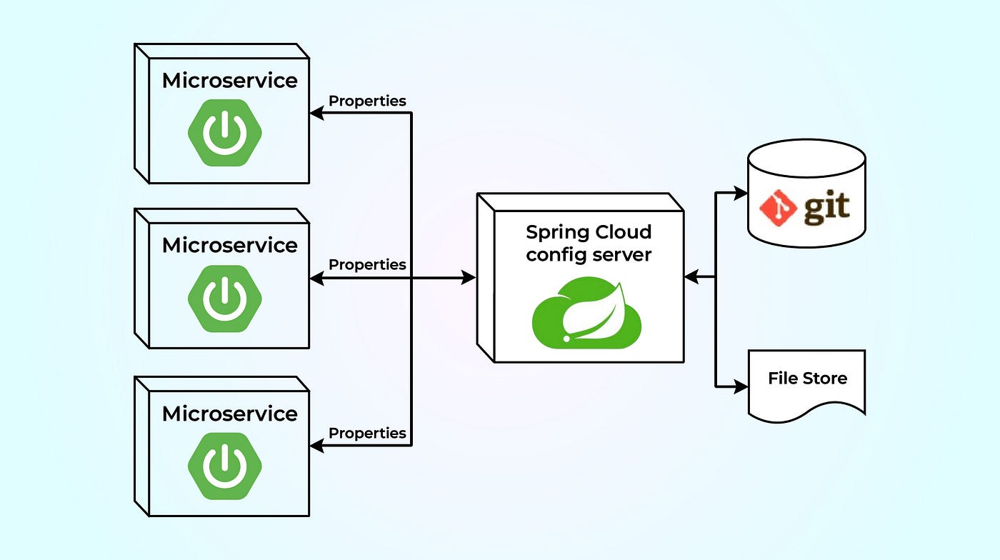

# Open BI Platform Global Configuration

## Introduction
Spring Cloud Config is a feature provided by the Spring framework to maintain all the configurations of your Spring applications in a central place. It provides client and server-side support for an externalized configuration. Besides,
we can store the configuration in `Git version control` or in the `file system` as well.

## Architecture
